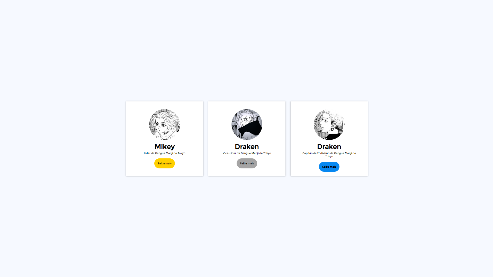

# Cards com React
* Projeto de uma página com cards utilizando REACT
## Finalidade
* Aplicar os conceitos de Componets e Props em REACT
## Tecnologias utilizadas
* REACT - v18.3.1
* CSS3
## Acessando o projeto
Você pode acessar o projeto clicando no link: [Cards com React](https://cards-com-react.netlify.app/) 
## Rodando o Projeto
Para compilar o projeto, você precisa ter instalado o ```Visual Studio Code``` e o ```Node.js```.  

[Download Visual Studio Code](https://code.visualstudio.com/download)      

[Download Node.JS](https://nodejs.org/en/download/current)

Após a instalação de ambos, você deve baixar os arquivos do projeto através do download.zip e extrai-los.
  
Após a extração, abra a pasta no Visual Studio Code.

Ao abrir a pasta do projeto no Visual Studio Code, clique em "Terminal"
  

Dentro do terminal, digite os seguintes códigos:  
```
npm install
```

```
npm run dev
```

O projeto abrirá no seu navegador padrão e está pronto para uso!

## Resultado do Projeto
* Desktop



* Mobile      
  